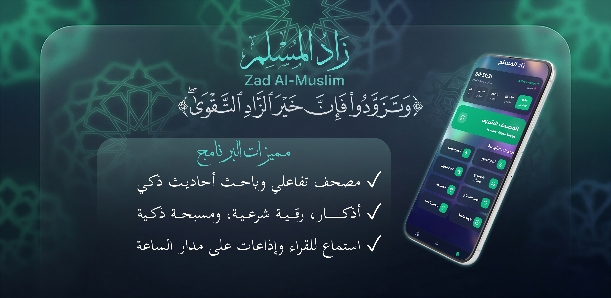

<div align="center">



<br>

# زاد المسلم — Zad Al-Muslim

[](https://solimananas.github.io/Tasbee7)
[](https://github.com/SolimanAnas/Tasbee7/stargazers)
[](https://github.com/SolimanAnas/Tasbee7/blob/main/LICENSE)

<br>

### <sub>"وَتَزَوَّدُوا فَإِنَّ خَيْرَ الزَّادِ التَّقْوَى"</sub>

<br>

A modern, lightweight, ad-free Progressive Web App — your all-in-one spiritual companion.

<br>

</div>

---

## ✨ Features

<div align="center">

| | Feature | Description |
|:---:|:---|:---|
| 📖 | **تصفّح المصحف** | Interactive Quran with 5 mushaf variants, word-level ayah highlighting, search, bookmarks, and offline caching |
| 🎧 | **الاستماع للقرآن** | Multi-reciter audio player with background playback, media session, and favorites |
| 📿 | **المسبحة** | Smart digital counter with haptic feedback, daily targets, lifetime stats, and OLED power-saving mode |
| 📻 | **إذاعة القرآن** | 24/7 live Quran radio broadcasts via HLS streaming |
| 🤲 | **أذكار الصباح والمساء** | Morning & evening supplications with interactive counters |
| 🌙 | **أذكار النوم** | Bedtime adhkar with read-and-count workflow |
| 📿 | **حصن المسلم** | Complete Hisn Al-Muslim — all daily and occasion-based supplications |
| 🕋 | **الرقية الشرعية** | Prophetic Ruqyah supplications |
| 📚 | **الأربعين النووية** | Imam An-Nawawi's 40 Hadith collection |
| 🎨 | **واجهة زجاجية** | 3-mode theme system (Dark Glass, Light Glass, Plain Dark) with smooth animations |
| 📱 | **تطبيق متكامل** | Installable PWA — works offline on iOS and Android |

</div>

---

## 🖥️ Desktop Features

<div align="center">

| Feature | Description |
|:---:|:---|
| 📐 **Fit-Width** | Full-width mushaf page view with vertical scroll |
| 📄 **Dual-Page** | Book-like two-page spread like a real Mushaf |
| ⬅️➡️ **Nav Buttons** | Edge navigation buttons for mouse/trackpad |
| ⌨️ **Keyboard** | Arrow keys to navigate pages |

</div>

---

## 🛠️ Tech Stack

| Layer | Technology |
|---|---|
| **Frontend** | HTML5, Vanilla JavaScript, CSS3 (Glassmorphism) |
| **Audio** | HLS.js for live radio, MP3 streaming, Media Session API |
| **Database** | SQLite via sql.js for ayah-level highlighting coordinates |
| **Storage** | localStorage for settings, bookmarks, and statistics |
| **PWA** | Service Workers + Web App Manifest for offline support |

---

## 🚀 Quick Start

```bash
git clone https://github.com/SolimanAnas/Tasbee7.git
cd Tasbee7
# Open index.html in your browser
```

---

## 📁 Project Structure

```
Tasbee7/
├── index.html              # Main entry — app home
├── quran.html              # Quran reader (primary)
├── css/
│   ├── style.css           # Global styles
│   └── _masbaha.css        # Masbaha styles
├── js/
│   ├── quran-common.js     # Shared Quran logic
│   ├── quran-app.js        # Quran app logic
│   ├── tasmee-engine.js    # Tasmee (recitation tracking) engine
│   ├── tasmee-matcher.js   # Speech-to-text matching
│   └── tasmee-store.js     # Tasmee data persistence
├── images/                 # App icons and assets
├── json/
│   └── medina2_coords.json # Ayah highlight coordinates
├── db/
│   ├── quranpages.sqlite   # Ayah bounding boxes database
│   ├── tafsir-saadi.db     # Saadi tafsir
│   └── tafsir-baghawi.db   # Baghawi tafsir
├── manifest.json           # PWA manifest
├── sw.js                   # Service worker
└── splash.png              # App splash screen
```

---

## 👨‍💻 Author

**Soliman Anas** — [@SolimanAnas](https://github.com/SolimanAnas)

Live App: [zad-al-muslim.vercel.app](https://solimananas.github.io/Tasbee7)

---

<div align="center">

*وَتَزَكَّوْا*

</div>
